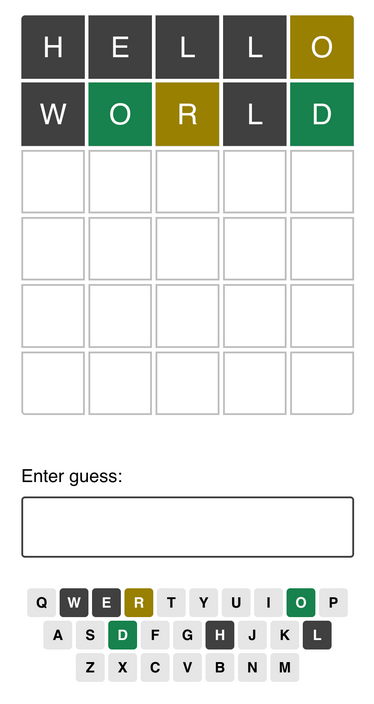

# Wordle React App

This is the first challenge project Joshua Comeau's **Joy of React** course.  
The challenge was to create Wordle game, and practice with setting up a basic react app,  
creating components, passing props, and conditional rendering.

All html structure, components, logic, react state management and scss styling made by myself.

## Github pages

To be added

## Design spec

## Features

Play the wordle game as much as you like!  
Supports adjusting of game difficulty via slider components,  
length of word & amount of guesses allowed can be changed. This resets the game.  
Previous guesses are listed, with indications for correct, misaligned and incorrect letters.  
On game win/loss, a game result banner is rendered and animated with button to restart.  
On game end, inputs are disabled until restart game button is clicked.  
Fully responsive design.

## Credits

Design-spec by Joshua Comeau.
